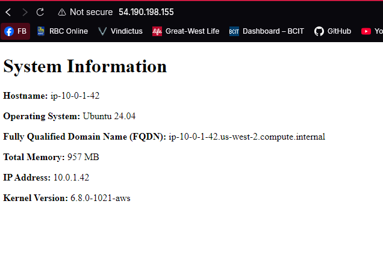

# 4640-w7-lab-start-w25

Use the command:
ssh-keygen -t ed25519 -f ~/.ssh/"key-name" -C "comment-to-identify-key"

to create a key to import into aws.

execute the script import_lab_key with the path to the new key as the first positional arguement.

change the working directory to the terraform folder and run terraform init
Next run terraform apply

Once terraform completes update the ip addresses of the ec2s to the hosts.yml file

run the ansible playbook with the command:
ansible-playbook playbook.yml

The web server html page will be hosted at port 80 and look like this image:
